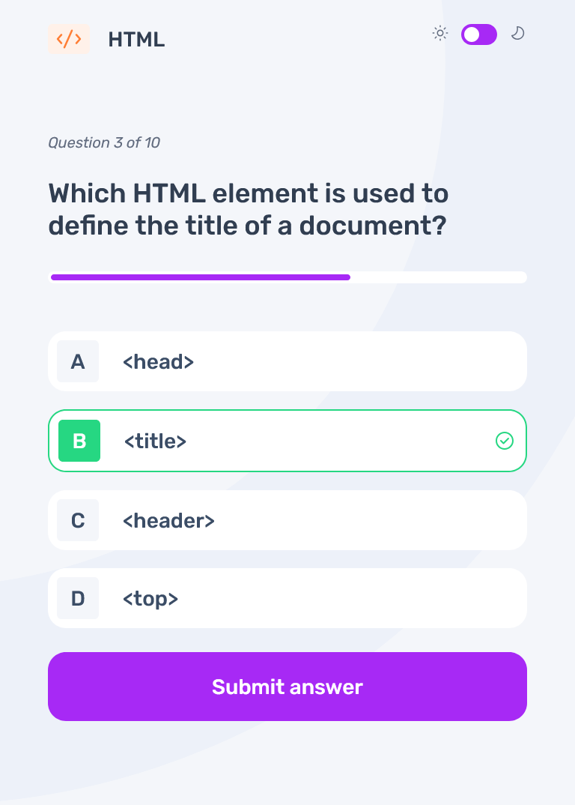

# Frontend Mentor - Frontend quiz app solution

This is a solution to the [Frontend quiz app challenge on Frontend Mentor](https://www.frontendmentor.io/challenges/frontend-quiz-app-BE7xkzXQnU). Frontend Mentor challenges help you improve your coding skills by building realistic projects.

## Table of contents

- [Overview](#overview)
  - [The challenge](#the-challenge)
  - [Screenshot](#screenshot)
  - [Links](#links)
  - [Built with](#built-with)
  - [What I learned](#what-i-learned)
- [Author](#author)

## Overview

### The challenge

Users should be able to:

- Select a quiz subject
- Select a single answer from each question from a choice of four
- See an error message when trying to submit an answer without making a selection
- See if they have made a correct or incorrect choice when they submit an answer
- Move on to the next question after seeing the question result
- See a completed state with the score after the final question
- Play again to choose another subject
- View the optimal layout for the interface depending on their device's screen size
- See hover and focus states for all interactive elements on the page
- Navigate the entire app only using their keyboard
- **Bonus**: Change the app's theme between light and dark

### Screenshot





### Links

- Solution URL: [Github](https://github.com/oloude)
- Live Site URL: [Add live site URL here](https://your-live-site-url.com)

## My process

### Built with

- Semantic HTML5 markup
- Flexbox
- Mobile-first workflow
- [React](https://reactjs.org/) - JS library
- [Typescript](https://www.typescriptlang.org/) - is JavaScript with syntax for types

### What I learned

Use this section to recap over some of your major learnings while working through this project. Writing these out and providing code samples of areas you want to highlight is a great way to reinforce your own knowledge.

To see how you can add code snippets, see below:

```js
import Question from "./Question";
import { QuizContext } from "./Quiz";
import { useContext, useEffect, useState } from "react";
import QuestionData from "../data.json";
import incorrectIcon from "../assets/icon-incorrect.svg";
import Timer from "./Timer";

function Questions() {
  const quizCtx = useContext(QuizContext);
  const questionNumber = quizCtx.state.currentNumber;
  const questionTopic = quizCtx.state.quizTopic;
  let selectedTopic = QuestionData.quizzes.find(
    (q) => q.title === questionTopic
  )?.questions[questionNumber];
  const answer = selectedTopic?.answer;
  const [userAnswer, setUserAnswer] = useState("");
  const [error, setError] = useState(false);

  function handleNext() {
    quizCtx.dispatch({ type: "NEXT QUESTION" });
  }

  function handleSubmit() {
    quizCtx.dispatch({ type: "SUBMIT" });
  }

  function handleClick() {
    if (questionNumber === 9 && userAnswer) {
      quizCtx.dispatch({ type: "UPDATE SCORE", points: Number(updateScore()) });
      handleSubmit();
    } else if (!userAnswer && quizCtx.state.isRunning) {
      setError(true);
      return;
    } else {
      quizCtx.dispatch({ type: "UPDATE SCORE", points: Number(updateScore()) });
      handleNext();
      setError(false);
      setUserAnswer("");
    }
  }

  function handleUserAnswer(value: string) {
    setUserAnswer(value);
  }

  function updateScore() {
    return userAnswer === answer;
  }

  useEffect(() => {
    if (quizCtx.state.time <= 0) {
      setError(false);
    }
  }, [quizCtx.state.time]);

  return (
    <div className="flex flex-col px-6 pt-8 pb-28 gap-10 md:px-16 md:pt-18 md:gap-16 lg:px-35 lg:flex-row lg:gap-33">
      <div className="flex flex-col gap-10 lg:min-w-[465px] lg:w-full">
        <div className="flex flex-col gap-3 md:gap-8 ">
          <h4 className="text-slate500 dark:text-blue300 text-sm italic md:text-xl">
            Question {questionNumber + 1} of 10
          </h4>
          <h2 className="text-slate700 dark:text-white text-xl font-medium leading-[120%] md:text-hMedium">
            {selectedTopic?.question}
          </h2>
        </div>
        <Timer />
      </div>
      <div className="flex flex-col gap-3 md:gap-8 lg:min-w-[564px] lg:w-full">
        <div className="flex flex-col gap-3 md:gap-6">
          {selectedTopic?.options.map((option, idx) => (
            <Question
              onClick={handleUserAnswer}
              userAnswer={userAnswer}
              answer={answer}
              key={option}
              option={option}
              letter={idx == 0 ? "A" : idx == 1 ? "B" : idx == 2 ? "C" : "D"}
            />
          ))}
        </div>
        <button
          onClick={handleClick}
          className="bg-purple300 px-3 py-3 rounded-xl text-white text-lg font-medium md:px-8 md:py-8 md:text-hSmall md:rounded-3xl"
        >
          Submit answer
        </button>
        {error && (
          <p className="flex gap-2 text-red text-sm items-center self-center">
             Please select
            an answer
          </p>
        )}
      </div>
    </div>
  );
}

export default Questions;
```

## Author

- Website - [Add your name here](https://www.your-site.com)
- Frontend Mentor - [@Oloude](https://www.frontendmentor.io/profile/oloude)
- Twitter - [@AbosedeOloude](https://www.twitter.com/abosedeoloude)
